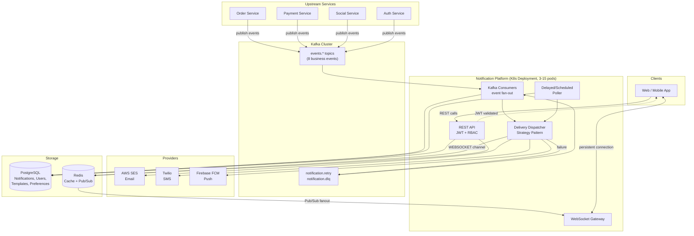
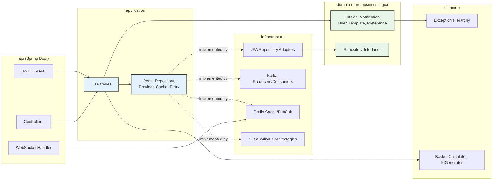
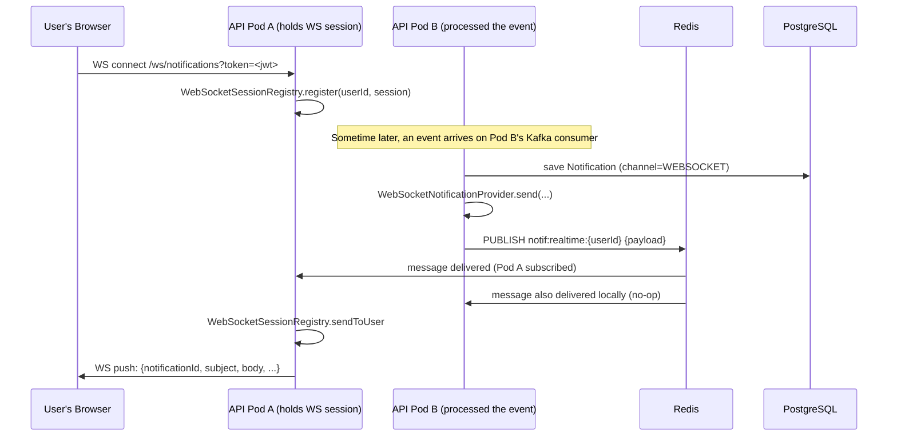
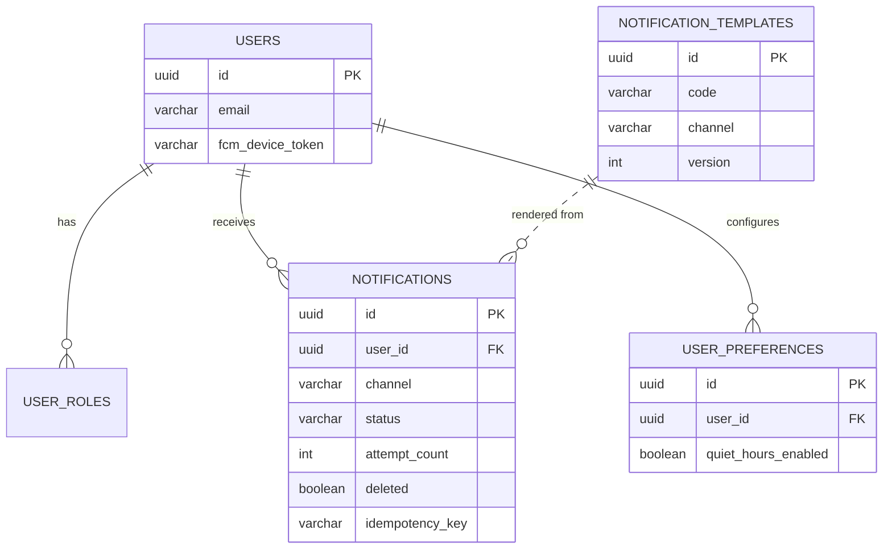

# Real-Time-Notification-System

A production-grade, multi-channel notification platform designed to deliver messages across Email, SMS, Push, WebSocket, and In-App channels. 

---

## 🏗️ System Design & Architecture

The system follows a strict **Clean Architecture (Hexagonal Architecture)** approach to ensure high scalability, decoupling, and maintainability.

### High-Level System Architecture
The platform is fully event-driven. Upstream microservices publish domain events (e.g., `OrderPlaced`, `PaymentSuccess`) to Kafka. The Notification Platform consumes these events, processes them asynchronously, and dispatches notifications via appropriate provider strategies.

### Clean Architecture Layering
The codebase is strictly separated into five modules. Dependencies point exclusively inwards toward the Domain, preventing infrastructure concerns (like JPA annotations or Kafka logic) from leaking into pure business logic.

### Real-Time WebSocket Fan-Out via Redis
To support horizontal scaling, the platform doesn't use sticky sessions. Instead, it leverages Redis Pub/Sub to seamlessly broadcast live notifications to whichever pod maintains a user's active connection.

### Entity-Relationship Diagram

---

## 🎯 What the Project Does

This platform acts as a centralized notification hub for modern applications. Rather than having each microservice in an ecosystem implement its own email, SMS, or push delivery logic, they simply fire a fire-and-forget domain event (like `OrderPlaced`). 

This system intercepts those events, evaluates user-defined preferences (like opting out of SMS or observing quiet hours), dynamically renders a localized template, and reliably delivers the notification via the appropriate channel. It is heavily modeled on the scalable notification systems used at companies like LinkedIn, Amazon, and Uber.

**Core Capabilities:**
- **Multi-channel routing:** Email, SMS, Firebase Push, WebSockets, and In-App persistence.
- **Preference Management:** Users can selectively opt in/out of specific channels per event type.
- **Resiliency:** Guaranteed delivery via exponential backoff (with full jitter) and Dead Letter Queues (DLQs).
- **Authentication:** Built-in JWT-based Role-Based Access Control (RBAC).

---

## ⚙️ How It Works

1. **Event Ingestion:** Microservices publish Kafka events.
2. **Idempotency & Processing:** A consumer picks up the event. It computes a unique idempotency key to guarantee duplicate Kafka deliveries won't spam the user. 
3. **Preference Evaluation:** The system fetches the user's notification preferences to confirm they've opted-in and aren't in "Quiet Hours".
4. **Delivery Dispatch:** The delivery payload is handed off to a **Strategy Pattern** implementation (`SesEmailProvider`, `TwilioSmsProvider`, etc.). 
5. **Real-time Delivery:** If the notification is for WebSockets, it is broadcast to a Redis Pub/Sub topic, ensuring the specific Kubernetes pod holding that user's TCP connection pushes it to their screen instantly.
6. **Retries:** If an external provider like AWS SES is down, the delivery fails over into a `notification.retry` topic and will back off exponentially before trying again.

---

## 💻 Tech Stack

| Component | Technology | Rationale |
|---|---|---|
| **Language** | Java 21 | Takes advantage of records, pattern matching, and virtual threads for high throughput. |
| **Framework** | Spring Boot 3 | Industry-standard backing for REST APIs and security integrations. |
| **Database** | PostgreSQL | Robust relational integrity with JSONB support for flexible event payloads. |
| **Cache/PubSub** | Redis | Sub-millisecond read times; facilitates stateless WebSocket message fan-outs across pods. |
| **Event Stream** | Apache Kafka | Durable, replayable, horizontally scalable message broker. |

---

## 🧰 Tools & Integrations

- **AWS SES**: Fast and highly deliverable Email infrastructure.
- **Twilio**: Global SMS carrier abstraction.
- **Firebase Cloud Messaging (FCM)**: Cross-platform mobile and web push notifications.
- **Gradle (Kotlin DSL)**: Strict multi-module build system to structurally enforce Clean Architecture dependencies at compile time.
- **Docker & Docker Compose**: Full local environment orchestration.
- **Kubernetes (K8s)**: Deployment manifests for HPA (Horizontal Pod Autoscaler), PDB, and rolling updates.
- **k6 (Grafana)**: Used for heavy REST API read-path load testing.
