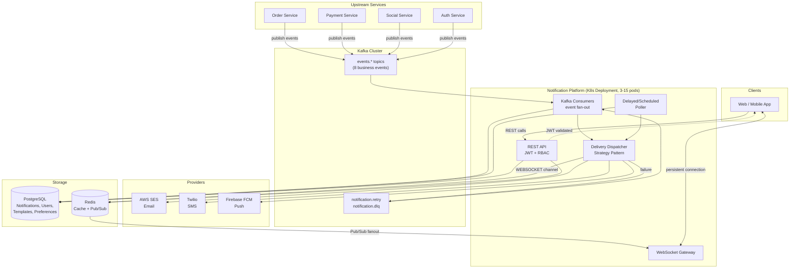
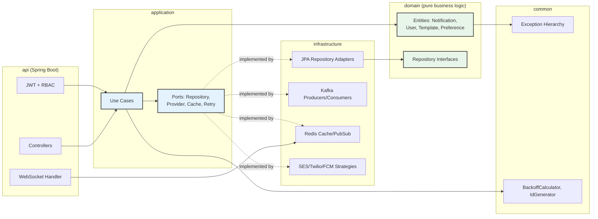
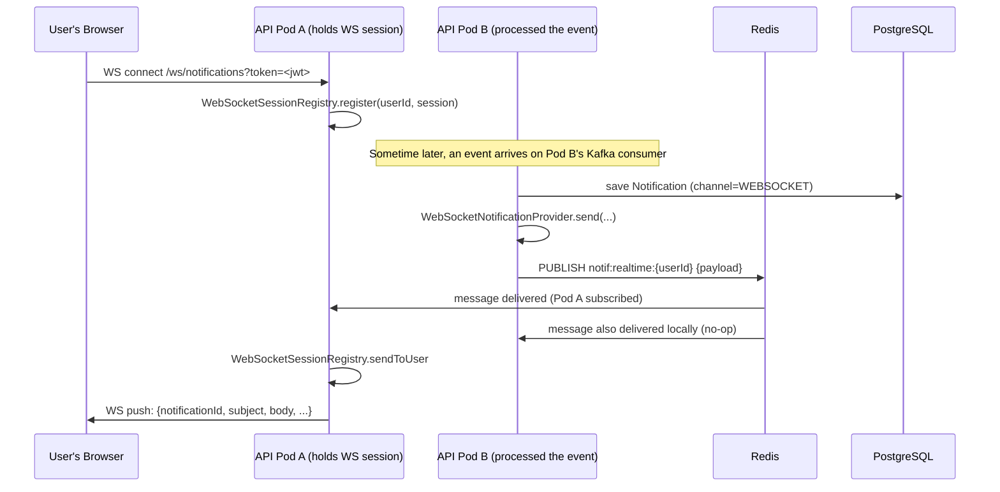
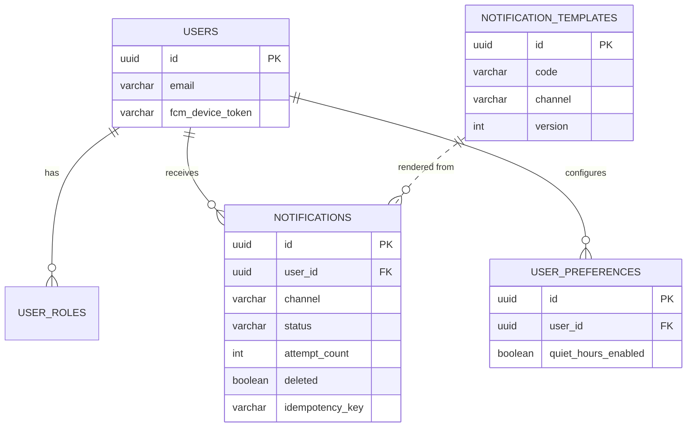

# Real-Time-Notification-System

A production-grade, multi-channel notification platform designed to deliver messages across Email, SMS, Push, WebSocket, and In-App channels. 

---

## 🏗️ System Design & Architecture

The system follows a strict **Clean Architecture (Hexagonal Architecture)** approach to ensure high scalability, decoupling, and maintainability.

### High-Level System Architecture
The platform is fully event-driven. Upstream microservices publish domain events (e.g., `OrderPlaced`, `PaymentSuccess`) to Kafka. The Notification Platform consumes these events, processes them asynchronously, and dispatches notifications via appropriate provider strategies.


```mermaid
flowchart TB
    subgraph Clients
        WebApp[Web / Mobile App]
    end

    subgraph "Upstream Services"
        OrderSvc[Order Service]
        PaymentSvc[Payment Service]
        SocialSvc[Social Service]
        AuthSvc[Auth Service]
    end

    subgraph "Kafka Cluster"
        EventTopics["events.* topics\n(8 business events)"]
        DeliveryFlow["notification.retry\nnotification.dlq"]
    end

    subgraph "Notification Platform (K8s Deployment, 3-15 pods)"
        API[REST API\nJWT + RBAC]
        WS[WebSocket Gateway]
        Consumers[Kafka Consumers\nevent fan-out]
        Scheduler[Delayed/Scheduled\nPoller]
        Dispatcher[Delivery Dispatcher\nStrategy Pattern]
    end

    subgraph Providers
        SES[AWS SES\nEmail]
        Twilio[Twilio\nSMS]
        FCM[Firebase FCM\nPush]
    end

    subgraph Storage
        Postgres[(PostgreSQL\nNotifications, Users,\nTemplates, Preferences)]
        Redis[(Redis\nCache + Pub/Sub)]
    end

    OrderSvc & PaymentSvc & SocialSvc & AuthSvc -->|publish events| EventTopics
    EventTopics --> Consumers
    Consumers --> Postgres
    Consumers --> Dispatcher
    Scheduler --> Postgres
    Scheduler --> Dispatcher
    Dispatcher --> SES & Twilio & FCM
    Dispatcher -->|WEBSOCKET channel| Redis
    Dispatcher -->|failure| DeliveryFlow
    DeliveryFlow --> Consumers

    Redis -->|Pub/Sub fanout| WS
    WS <-->|persistent connection| WebApp
    WebApp -->|REST calls| API
    API --> Postgres
    API --> Redis
    API -.JWT validated.-> WebApp
```

### Clean Architecture Layering
The codebase is strictly separated into five modules. Dependencies point exclusively inwards toward the Domain, preventing infrastructure concerns (like JPA annotations or Kafka logic) from leaking into pure business logic.


```mermaid
flowchart LR
    subgraph "api (Spring Boot)"
        Controllers[Controllers]
        Security[JWT + RBAC]
        WSHandler[WebSocket Handler]
    end

    subgraph "infrastructure"
        JPA[JPA Repository Adapters]
        KafkaAdapters[Kafka Producers/Consumers]
        RedisAdapters[Redis Cache/PubSub]
        Providers[SES/Twilio/FCM Strategies]
    end

    subgraph "application"
        UseCases[Use Cases]
        Ports[Ports: Repository,\nProvider, Cache, Retry]
    end

    subgraph "domain (pure business logic)"
        Entities[Entities: Notification,\nUser, Template, Preference]
        RepoPorts[Repository Interfaces]
    end

    subgraph "common"
        Exceptions[Exception Hierarchy]
        Utils[BackoffCalculator, IdGenerator]
    end

    Controllers --> UseCases
    Security --> UseCases
    WSHandler --> RedisAdapters
    UseCases --> Ports
    UseCases --> Entities
    Ports -.implemented by.-> JPA
    Ports -.implemented by.-> KafkaAdapters
    Ports -.implemented by.-> RedisAdapters
    Ports -.implemented by.-> Providers
    JPA --> RepoPorts
    Entities --> Exceptions
    UseCases --> Utils

    style Entities fill:#e8f5e9,stroke:#333,stroke-width:2px
    style RepoPorts fill:#e8f5e9,stroke:#333,stroke-width:2px
    style UseCases fill:#e3f2fd,stroke:#333,stroke-width:2px
    style Ports fill:#e3f2fd,stroke:#333,stroke-width:2px
```

### Real-Time WebSocket Fan-Out via Redis
To support horizontal scaling, the platform doesn't use sticky sessions. Instead, it leverages Redis Pub/Sub to seamlessly broadcast live notifications to whichever pod maintains a user's active connection.


```mermaid
sequenceDiagram
    participant UserA as User's Browser
    participant PodA as API Pod A (holds WS session)
    participant PodB as API Pod B (processed the event)
    participant Redis
    participant DB as PostgreSQL

    UserA->>PodA: WS connect /ws/notifications?token=<jwt>
    PodA->>PodA: WebSocketSessionRegistry.register(userId, session)

    Note over PodB: Sometime later, an event arrives on Pod B's Kafka consumer
    PodB->>DB: save Notification (channel=WEBSOCKET)
    PodB->>PodB: WebSocketNotificationProvider.send(...)
    PodB->>Redis: PUBLISH notif:realtime:{userId} {payload}

    Redis->>PodA: message delivered (Pod A subscribed)
    Redis->>PodB: message also delivered locally (no-op)
    PodA->>PodA: WebSocketSessionRegistry.sendToUser
    PodA->>UserA: WS push: {notificationId, subject, body, ...}
```

### Entity-Relationship Diagram

```mermaid
erDiagram
    USERS ||--o{ USER_ROLES : has
    USERS ||--o{ NOTIFICATIONS : receives
    USERS ||--o{ USER_PREFERENCES : configures
    NOTIFICATION_TEMPLATES ||..o{ NOTIFICATIONS : "rendered from"

    USERS {
        uuid id PK
        varchar email
        varchar fcm_device_token
    }

    NOTIFICATIONS {
        uuid id PK
        uuid user_id FK
        varchar channel
        varchar status
        int attempt_count
        boolean deleted
        varchar idempotency_key
    }

    USER_PREFERENCES {
        uuid id PK
        uuid user_id FK
        boolean quiet_hours_enabled
    }

    NOTIFICATION_TEMPLATES {
        uuid id PK
        varchar code
        varchar channel
        int version
    }
```

---

## 🎯 What the Project Does

This platform acts as a centralized notification hub for modern applications. Rather than having each microservice in an ecosystem implement its own email, SMS, or push delivery logic, they simply fire a fire-and-forget domain event (like `OrderPlaced`). 

This system intercepts those events, evaluates user-defined preferences (like opting out of SMS or observing quiet hours), dynamically renders a localized template, and reliably delivers the notification via the appropriate channel. It is heavily modeled on the scalable notification systems used at companies like LinkedIn, Amazon, and Uber.

**Core Capabilities:**
- **Multi-channel routing:** Email, SMS, Firebase Push, WebSockets, and In-App persistence.
- **Preference Management:** Users can selectively opt in/out of specific channels per event type.
- **Resiliency:** Guaranteed delivery via exponential backoff (with full jitter) and Dead Letter Queues (DLQs).
- **Authentication:** Built-in JWT-based Role-Based Access Control (RBAC).

---

## ⚙️ How It Works

1. **Event Ingestion:** Microservices publish Kafka events.
2. **Idempotency & Processing:** A consumer picks up the event. It computes a unique idempotency key to guarantee duplicate Kafka deliveries won't spam the user. 
3. **Preference Evaluation:** The system fetches the user's notification preferences to confirm they've opted-in and aren't in "Quiet Hours".
4. **Delivery Dispatch:** The delivery payload is handed off to a **Strategy Pattern** implementation (`SesEmailProvider`, `TwilioSmsProvider`, etc.). 
5. **Real-time Delivery:** If the notification is for WebSockets, it is broadcast to a Redis Pub/Sub topic, ensuring the specific Kubernetes pod holding that user's TCP connection pushes it to their screen instantly.
6. **Retries:** If an external provider like AWS SES is down, the delivery fails over into a `notification.retry` topic and will back off exponentially before trying again.

---

## 💻 Tech Stack

| Component | Technology | Rationale |
|---|---|---|
| **Language** | Java 21 | Takes advantage of records, pattern matching, and virtual threads for high throughput. |
| **Framework** | Spring Boot 3 | Industry-standard backing for REST APIs and security integrations. |
| **Database** | PostgreSQL | Robust relational integrity with JSONB support for flexible event payloads. |
| **Cache/PubSub** | Redis | Sub-millisecond read times; facilitates stateless WebSocket message fan-outs across pods. |
| **Event Stream** | Apache Kafka | Durable, replayable, horizontally scalable message broker. |

---

## 🧰 Tools & Integrations

- **AWS SES**: Fast and highly deliverable Email infrastructure.
- **Twilio**: Global SMS carrier abstraction.
- **Firebase Cloud Messaging (FCM)**: Cross-platform mobile and web push notifications.
- **Gradle (Kotlin DSL)**: Strict multi-module build system to structurally enforce Clean Architecture dependencies at compile time.
- **Docker & Docker Compose**: Full local environment orchestration.
- **Kubernetes (K8s)**: Deployment manifests for HPA (Horizontal Pod Autoscaler), PDB, and rolling updates.
- **k6 (Grafana)**: Used for heavy REST API read-path load testing.

---

## 🚀 Quickstart

```bash
cp .env.example .env            # fill in secrets as needed
docker compose up -d --build    # postgres + redis + kafka + backend + nginx/SPA
```

- UI: http://localhost (React SPA — public `/welcome` landing, dark/light theme, mobile bottom nav)
- API: http://localhost:8080 · Swagger: http://localhost:8080/swagger-ui.html (Authorize with `Bearer <token>`)
- Health: `/health`, `/health/live`, `/health/ready` (+ `/actuator/health`, `/actuator/prometheus`)

**Local dev without cloud credentials** (log-only delivery, no SES/Twilio/Firebase):

```bash
docker compose up -d postgres redis kafka
SPRING_PROFILES_ACTIVE=local ./gradlew :api:bootRun   # MockEmail/Sms/Push providers
cd frontend && npm install && npm run dev              # http://localhost:5173
```

---

## 📡 API Surface (v1)

| Area | Endpoints |
|---|---|
| Auth | `POST /api/v1/auth/register`, `POST /api/v1/auth/login` |
| Inbox | `GET /api/v1/notifications?type=&since=&before=&page=&size=`, `GET /unread-count`, `PATCH /{id}/read`, `PATCH /{id}/unread`, `PATCH /read-all`, `DELETE /{id}` |
| Preferences | `GET /api/v1/preferences`, `PUT /{eventType}/channel`, `PUT /{eventType}/quiet-hours`, `PUT /{eventType}/intent`, `PUT /{eventType}/push`, `PUT /{eventType}/frequency-caps`, `PUT /{eventType}/digest`, `DELETE /{eventType}` |
| Health | `GET /health`, `GET /health/live`, `GET /health/ready` |
| Admin (`ROLE_ADMIN`) | `GET /api/v1/admin/stats`, `POST /api/v1/admin/broadcast`, `GET /api/v1/admin/delivery-metrics`, `GET /api/v1/admin/active-sessions`, templates CRUD |
| Internal (`SERVICE`/`ADMIN`) | `POST /api/v1/internal/notifications/schedule` |
| Realtime | `ws://host/ws/notifications?token=<jwt>` (server→client push) |

---

## 📈 Reliability, Observability & Ops

- **Retry:** time-bucketed topics (`notification.retry-30s/-5m/-30m`) bound worst-case consumer waits; legacy `notification.retry` still consumed. A Redis ZSET delay queue (`RedisRetryDelayQueue`) is available as an alternative.
- **Poison pills:** malformed event payloads are quarantined to `events.poison-pill` with per-topic counters (`kafka.events.poison-pill.total`).
- **DLQ:** `notification.dlq` increments `notifications.dlq.total{reason}` and fires a Slack/PagerDuty-compatible webhook (`notification.alerting.webhook-url`).
- **Metrics (`/actuator/prometheus`):** `notifications.dispatched.total{channel,eventType,status}`, `notification.delivery.latency{channel}`, `websocket.sessions.active`, `kafka.events.consumed.total{eventType}`, `notifications.retry.scheduled.total{bucket}`.
- **Retention:** `NotificationRetentionJob` hard-deletes rows older than `notification.retention.days` (default 90) nightly.
- **Rate limiting:** fixed-window Redis limiter on notification/internal/broadcast **plus auth (login/register)** paths (429 + `Retry-After`), fail-open; nginx adds edge limiting too.
- **Priorities:** notifications carry `LOW/MEDIUM/HIGH` priority (V3 migration) surfaced in inbox responses.

## 🧠 Notification quality features

Patterns taken from production notification systems (Slack's 2026 rebuild, LinkedIn's
Air Traffic Controller, SuprSend digests, DoorDash template rollout) and implemented here:

| Feature | Behavior | Where |
|---|---|---|
| **Intent vs delivery split** | `intent` (ALL / MENTIONS / MUTE) decides *whether* an event notifies; channel opt-in, `pushEnabled`, quiet hours, caps and digest decide *how*. Security events (OTP, password reset) always deliver. | `NotificationIntent`, `ProcessIncomingEventUseCase` |
| **Digest batching** | Opted-in low-value email becomes `QUEUED_DIGEST` and is flushed as **one grouped email per user** on a cron. Empty digests never send; a 1-item digest reuses its own subject; a failed digest stays queued. In-app stays instant. | `DeliveryPolicy`, `DigestFlushUseCase`, `DigestFlushJob` |
| **ATC frequency caps** | `maxPushesPerDay` + `minHoursBetweenPushes` per event type. Over-budget pushes are **deferred (SCHEDULED), never dropped**; other channels are never capped. | `FrequencyCapPolicy` |
| **Event schema validation** | All 8 topics validated before fan-out (required attributes, UUID user, ≤5 min clock skew). Invalid payloads are quarantined as poison pills with a precise reason instead of persisting partial rows. | `EventMessageValidator`, `NotificationEventConsumer` |
| **Provider circuit breaker** | Per-channel breaker on consecutive *retryable* failures (429s/outage). Opens → fails fast into the retry path; half-open after cooldown. Permanent failures never trip it. | `ProviderCircuitBreaker`, `DeliveryGuardPort` |
| **Gradual template rollout** | New template version serves `trafficPct`% of users via a stable per-user hash (no flip-flopping); everyone else keeps the previous version. `trafficPct=100` = instant cutover. | `TemplateRolloutSelector`, `traffic_pct` |
| **Typed WS frames + heartbeat** | `{"type":"notification"\|"unread_count"\|"connected"\|"pong"}` envelopes, 30s server ping, unread count pushed without a page refresh, per-session send serialization, dead-session eviction. | `NotificationWebSocketHandler`, `RedisRealtimeSubscriber` |
| **Virtual threads** | `spring.threads.virtual.enabled=true` — IO-bound WS fan-out and provider calls scale without pool tuning. | `application.yml` |
| **Consumer lag metrics** | `kafka.consumer.lag{group}` / `kafka.consumer.lag.total` sampled via AdminClient for dashboards and autoscaling. | `KafkaConsumerLagMetrics` |

New metrics: `notifications.digest.queued.total`, `notifications.digest.flushed.total`,
`notifications.digest.pending`, `notifications.frequency-capped.total`,
`provider.circuit-breaker.opens.total`, `template.rollout.diverted.total`,
`kafka.consumer.lag`.

- **Production:** `docker-compose.prod.yml` (only 80/443 exposed, ARM64-safe `apache/kafka` KRaft, resource limits, log rotation), `nginx.prod.conf` (TLS + HSTS), `scripts/deploy.sh` (health-gated, rollback), `scripts/smoke_test.sh`, `scripts/backup_postgres.sh` / `restore_postgres.sh`. Full guide: `docs/ORACLE_DEPLOYMENT.md`. Architecture: `docs/ARCHITECTURE.md`. Baseline audit: `docs/BASELINE_AUDIT.md`. Measured perf only: `docs/PERFORMANCE.md`.

## ✅ Testing

```bash
./gradlew test   # 94 tests: WebMvc slices, use-case units, Testcontainers (Postgres) + Kafka/Redis flows
```

Requires JDK 21 to run Gradle and a Docker daemon for the Testcontainers suites.

### Frontend

```bash
cd frontend
npm run build             # tsc -b (typecheck gate) + production bundle
npm run lint              # oxlint
npm run test:visual       # 235 checks: 168 screenshot baselines + behaviour/a11y assertions
npm run test:visual:update   # regenerate baselines — review the diff before committing

cd .. && ./scripts/verify_delivery.sh   # 22 delivery-layer checks against a real nginx
```

The visual suite covers 21 page/state scenarios across all 8 required viewports
(390 → 1920), in both themes, plus empty and error states. Alongside the screenshots it
*asserts* no horizontal overflow, keyboard and focus-trap behaviour, zero console
errors, WCAG AA text contrast measured over the WebGL shader, and that no request
leaves the origin.

`verify_delivery.sh` covers what nginx owns: CSP and security headers on every SPA
route, immutable asset caching, the SPA fallback, the backend health proxy, and the
absence of Node in the runtime image.

### Documentation

> **Building new UI?** Start with [`DESIGN.md`](DESIGN.md) — it is the self-contained
> replication spec (tokens, fonts, component metrics, motion, a11y). Hand it to an agent and
> it can match the existing design without reading the codebase.

| Document | Contents |
|---|---|
| [`DESIGN.md`](DESIGN.md) | **Authoritative UI replication spec** — paste-ready token block, type scale, component metrics, motion rules, accessibility bar. Hand this to an agent to reproduce the UI |
| [`docs/UI-UX.md`](docs/UI-UX.md) | Design system rationale, component inventory, motion guidelines, accessibility strategy, deliberate omissions |
| [`docs/FRONTEND_ARCHITECTURE.md`](docs/FRONTEND_ARCHITECTURE.md) | Structure, state, API contract, build/delivery pipeline, CSP, performance |
| [`docs/VISUAL_REGRESSION.md`](docs/VISUAL_REGRESSION.md) | How visual regression works, how to run it, what it cannot catch |
| [`docs/VISUAL_QA_REPORT.md`](docs/VISUAL_QA_REPORT.md) | Page × viewport results, every defect found and fixed, acceptance checklist |
| [`docs/ORACLE_DEPLOYMENT.md`](docs/ORACLE_DEPLOYMENT.md) | Deployment and operations on the Oracle Free Tier VM |
| [`docs/EMAIL_SERVICE_INTEGRATION.md`](docs/EMAIL_SERVICE_INTEGRATION.md) | External email service as the EMAIL transport, mass-email campaigns, the daily-quota ceiling, and the upstream auth blocker |
