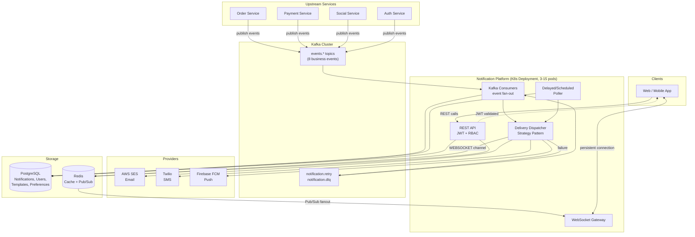
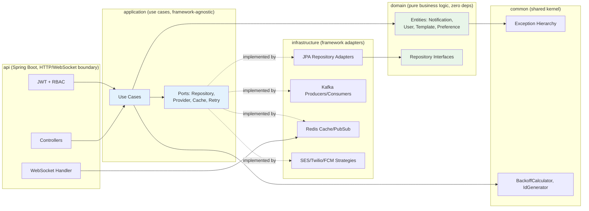
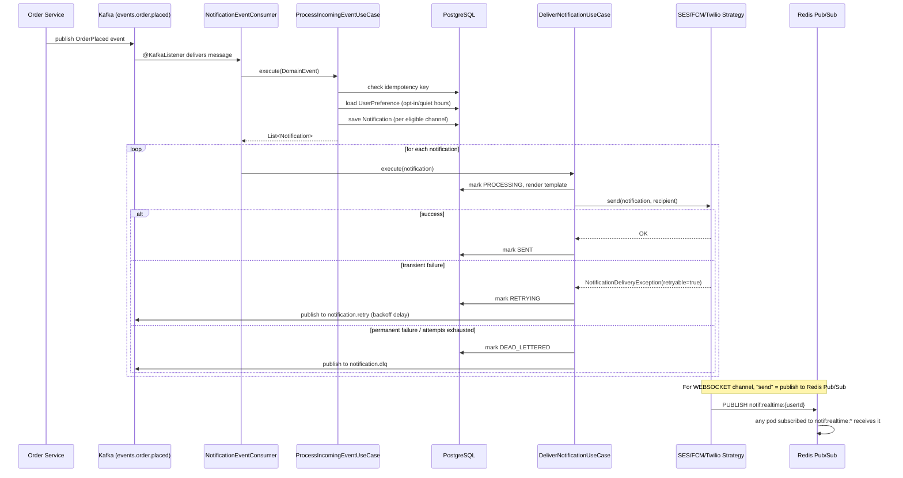
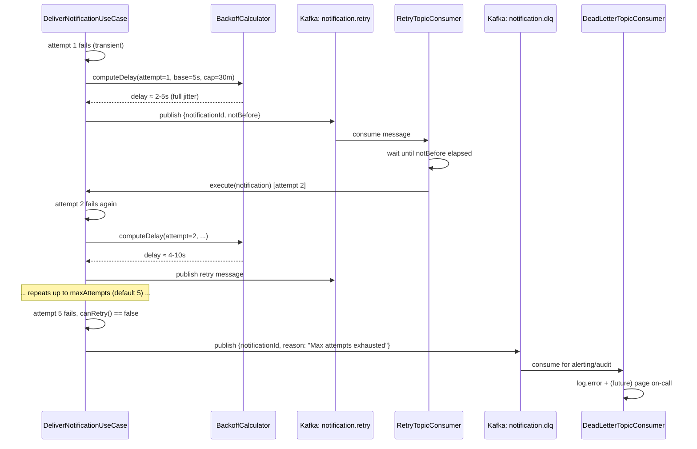
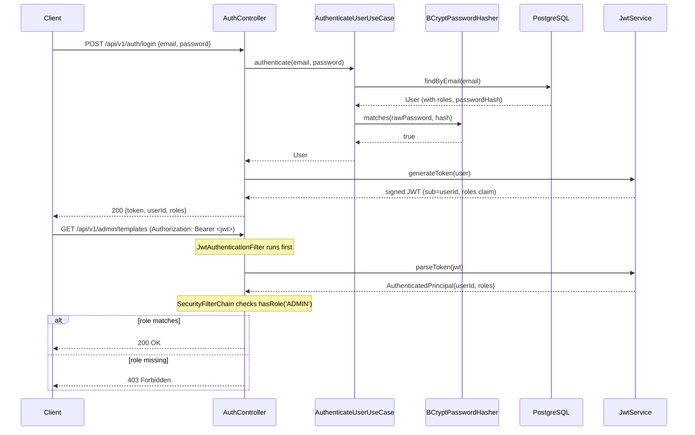
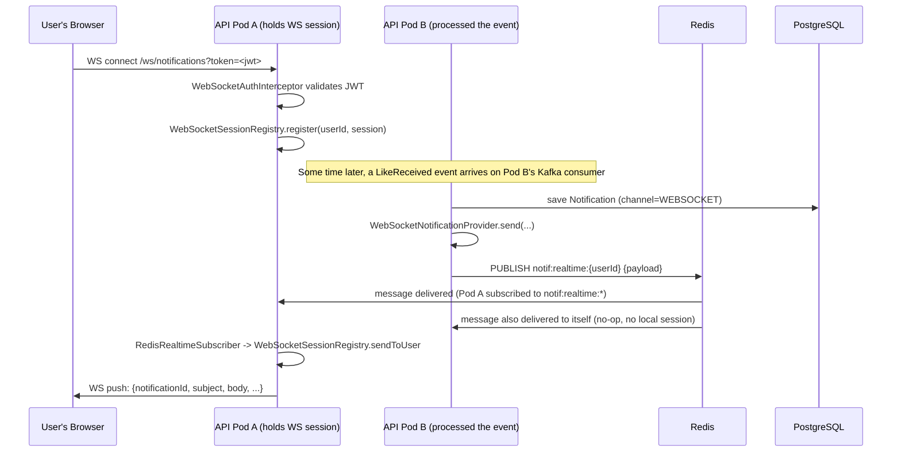
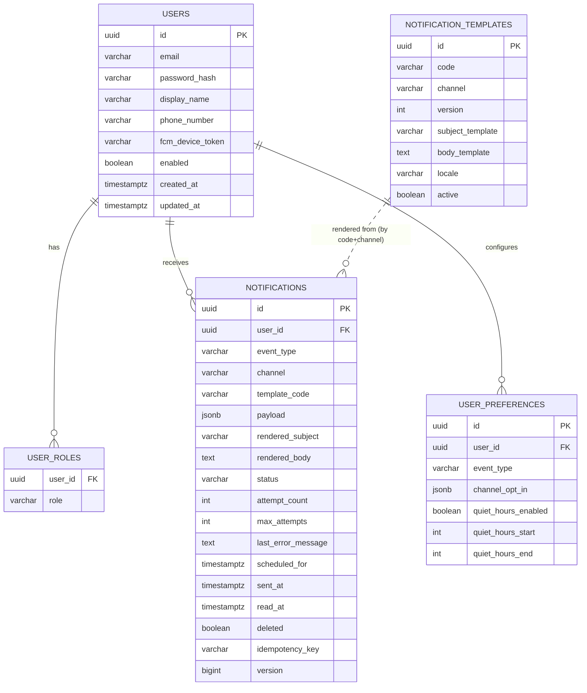

# Architecture & Sequence Diagrams

All diagrams are written in [Mermaid](https://mermaid.js.org/) syntax. GitHub, GitLab, and most
modern Markdown viewers render Mermaid blocks natively; to render manually use the
[Mermaid Live Editor](https://mermaid.live).

## 1. High-Level System Architecture

**Why this shape:** ingestion (Kafka consumers) and delivery (Dispatcher/provider strategies) are
decoupled from the REST/WebSocket read path. A slow SES/Twilio/FCM call never blocks a user
checking their inbox, and the API tier can scale independently of consumer throughput.

## 2. Clean Architecture Layering

**Dependency rule:** arrows only point inward. `domain` has zero framework dependencies (no
Spring, no JPA annotations); `application` depends only on `domain`+`common` and defines ports
that `infrastructure` implements. This is enforced structurally by the Gradle module graph, not
just convention — `domain`'s `build.gradle.kts` doesn't even have Spring on its classpath, so a
violation is a compile error, not a code review nit.

## 3. Sequence: Event-Driven Notification Delivery (e.g. OrderPlaced)

## 4. Sequence: Retry with Exponential Backoff + Dead Letter Queue

## 5. Sequence: JWT Authentication + RBAC

## 6. Sequence: Real-Time WebSocket Delivery Across Pods

**Why Redis Pub/Sub instead of sticky sessions:** the pod that processes a Kafka event is
essentially random relative to which pod holds a given user's live WebSocket connection.
Rather than requiring sticky load-balancer routing (which complicates rolling deploys and
autoscaling), every pod subscribes to the same Pub/Sub pattern and simply no-ops for users it
doesn't hold locally.

## 7. Entity-Relationship Diagram

