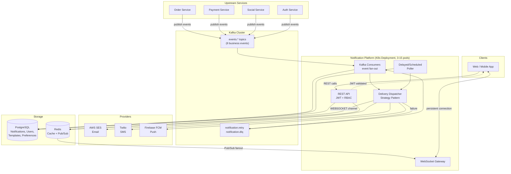
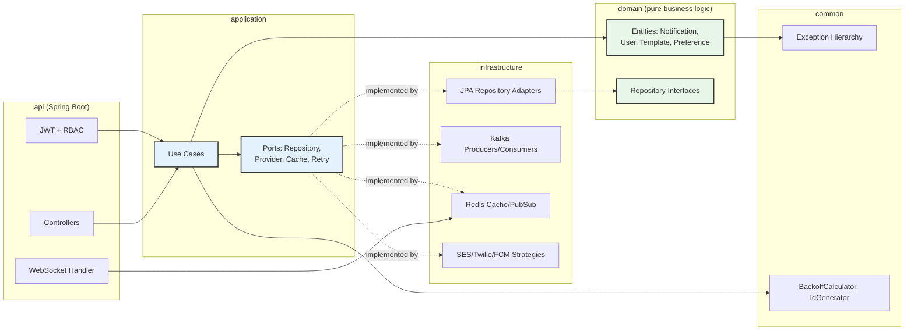
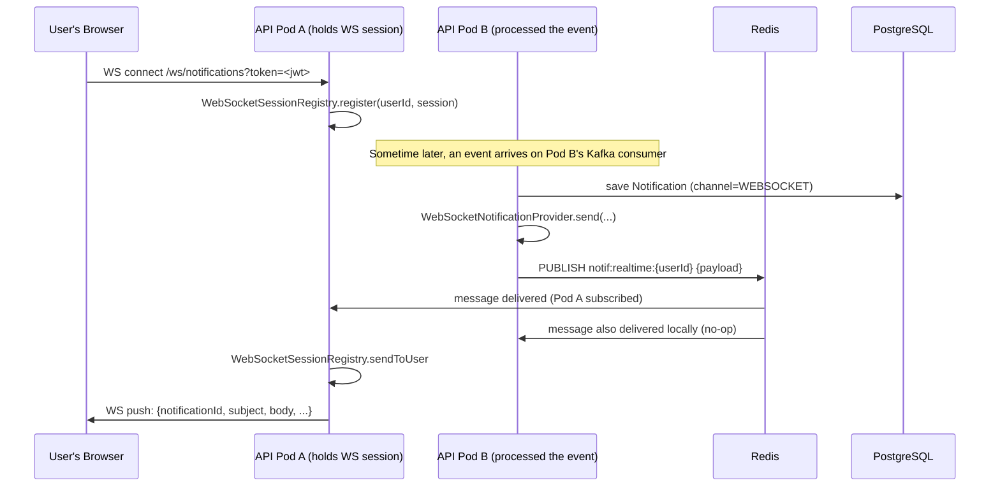
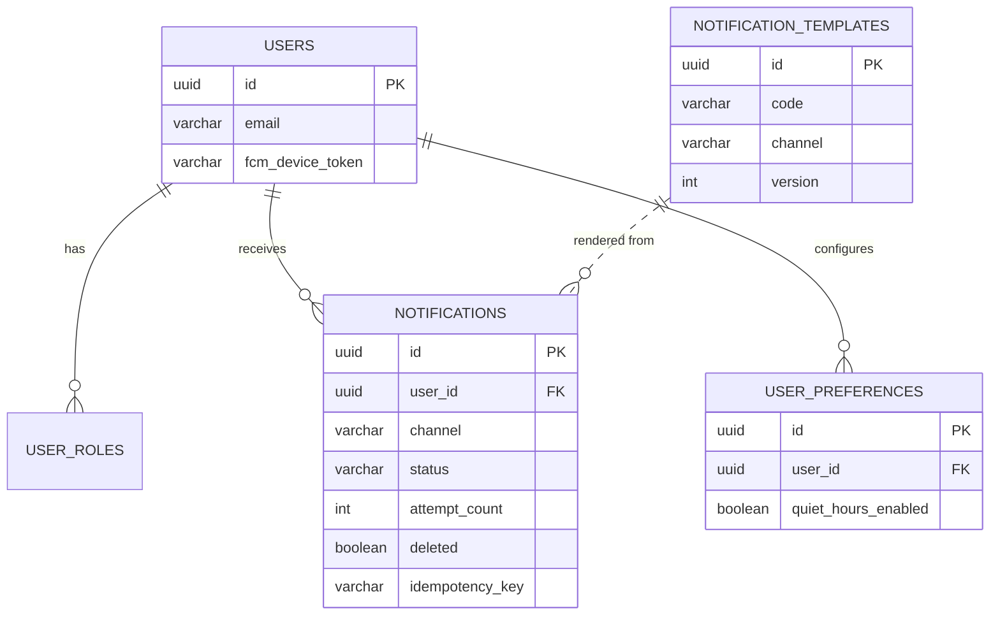

# System Design & Architecture Analysis

Based on an analysis of the repository's structure and existing documentation, the project follows a **Clean Architecture** (Hexagonal Architecture) approach, functioning as a production-grade, event-driven notification platform. It heavily utilizes **Java 21**, **Spring Boot 3**, **Apache Kafka**, **Redis**, and **PostgreSQL**.

Below are the architectural and sequence diagrams (rendered dynamically using Mermaid) that illustrate the system's design. These are visually similar to Excalidraw-style flowcharts and are perfect for a GitHub repository.

## 1. High-Level System Architecture

This diagram shows how external upstream services publish events into Kafka, which the Notification Platform consumes, processes, and dispatches via various provider strategies.

## 2. Clean Architecture Layering

The codebase is split into 5 distinct modules (api, application, infrastructure, domain, common). Dependencies point strictly inward.

## 3. Real-Time WebSocket Fan-Out via Redis

Because the platform is designed to scale horizontally across many Kubernetes pods, sticky sessions aren't used. Instead, it relies on Redis Pub/Sub to deliver live WebSocket events to whichever pod happens to hold the active user session.

## 4. Entity-Relationship (Database) Diagram

